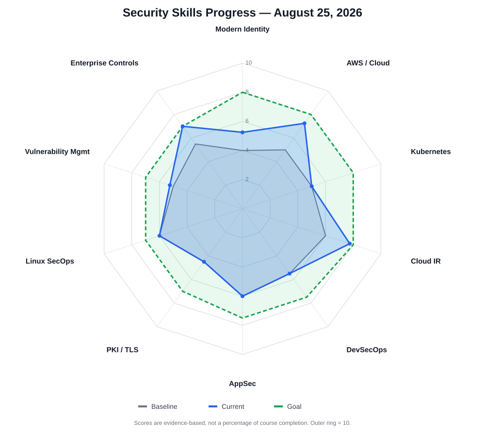

# Security Skills Progress Tracker

**Baseline date:** August 11, 2026  
**Last updated:** August 27, 2026
**Scale:** 0–10, where 10 represents strong specialist-level working knowledge  
**Scoring policy:** Scores change only when dated notes contain demonstrated evidence. Discussion, recognition, or a correct guess alone does not increase a score.

---

## Current Progress Matrix

| Skill area | Initial | Current | Goal | Change | Remaining gap |
|---|---:|---:|---:|---:|---:|
| Modern Identity | 4.0 | 5.75 | 8.0 | +1.75 | 2.25 |
| AWS / Cloud Security | 5.0 | 7.75 | 8.0 | +2.75 | 0.25 |
| Kubernetes Security | 5.0 | 5.5 | 8.0 | +0.5 | 2.5 |
| Cloud / Modern Incident Response | 6.0 | 8.0 | 8.0 | +2.0 | 0.0 |
| DevSecOps / CI-CD Security | 5.5 | 5.5 | 7.5 | — | 2.0 |
| Application Security | 6.0 | 6.0 | 7.5 | — | 1.5 |
| PKI / TLS / Secrets | 4.5 | 5.25 | 7.0 | +0.75 | 1.75 |
| Linux Security Operations | 6.0 | 6.0 | 7.0 | — | 1.0 |
| Vulnerability Management | 5.0 | 5.25 | 7.0 | +0.25 | 1.75 |
| Enterprise Security Controls | 5.5 | 7.0 | 7.0 | +1.5 | 0.0 |

## Radar View: Initial, Current, and Goal

The chart uses the same 0–10 evidence-based scores as the table. Moving outward means stronger demonstrated working knowledge; it does **not** mean percent completion of a fixed course.

### Overall interpretation

The strongest measured improvement remains **AWS / Cloud Security**, with supporting gains in **Modern Identity**, **Cloud / Modern Incident Response**, and **Enterprise Security Controls**. The Minikube lab added the first substantial hands-on evidence for **Kubernetes Security**: namespace isolation, service-account workload identity, Role and RoleBinding mechanics, real in-pod API requests, allow → deny → allow testing, namespace boundaries, and projected-token hardening. Modern Identity also increased slightly because the workload-identity model was transferred from AWS Lambda to Kubernetes and connected to concrete authentication and authorization outcomes. Cloud / Modern Incident Response and Enterprise Security Controls remain at their current roadmap goals, meaning the planned practical foundations have been demonstrated—not specialist mastery.

No score was increased for AWS, Cloud IR, DevSecOps, AppSec, PKI/TLS/Secrets, Linux operations, Vulnerability Management, or Enterprise Controls because this local lab did not provide sufficient new evidence beyond their current levels.

---

## Initial Matrix

This is the fixed August 2026 assessment baseline. It should never be rewritten to match later ability.

| Skill area | Initial score | Baseline interpretation |
|---|---:|---|
| Modern Identity | 4.0 | Security awareness present; architecture and operational mechanics needed development |
| AWS / Cloud Security | 5.0 | Familiar with major services and threats; needed stronger independent configuration and troubleshooting |
| Kubernetes Security | 5.0 | Conceptual familiarity; limited hands-on operational evidence |
| Cloud / Modern Incident Response | 6.0 | Existing investigation strength; needed deeper cloud-native telemetry and identity reconstruction |
| DevSecOps / CI-CD Security | 5.5 | Familiar with tools and pipeline concepts; needed an end-to-end practical workflow |
| Application Security | 6.0 | Strong attack reasoning; defensive source-to-sink method needed more consistent demonstration |
| PKI / TLS / Secrets | 4.5 | Lower-confidence estimate; needed practical identity, certificate, and secrets-management work |
| Linux Security Operations | 6.0 | Useful operational foundation; needed more cloud/container-oriented repetition |
| Vulnerability Management | 5.0 | Familiar with scanning concepts; prioritization and remediation workflow needed more evidence |
| Enterprise Security Controls | 5.5 | General security-controls knowledge; cloud policy evaluation and governance needed deeper practice |

---

## Goal Matrix

| Skill area | Goal | What reaching the goal should mean |
|---|---:|---|
| Modern Identity | 8.0 | Independently explain, configure, troubleshoot, and investigate human and workload identity flows |
| AWS / Cloud Security | 8.0 | Independently secure and investigate common AWS architectures, identity, networking, data, and telemetry |
| Kubernetes Security | 8.0 | Independently reason about workload identity, RBAC, network policy, runtime controls, nodes, and control plane exposure |
| Cloud / Modern Incident Response | 8.0 | Reconstruct cloud incidents across identity, control plane, workload, and network telemetry |
| DevSecOps / CI-CD Security | 7.5 | Build and operate a practical secure pipeline with findings triage and remediation |
| Application Security | 7.5 | Trace vulnerabilities systematically from source through transforms to sink and propose robust fixes |
| PKI / TLS / Secrets | 7.0 | Confidently operate certificate, TLS, key, token, and secrets-management workflows |
| Linux Security Operations | 7.0 | Independently investigate, harden, and troubleshoot Linux systems used in modern workloads |
| Vulnerability Management | 7.0 | Prioritize, validate, assign, remediate, and verify vulnerabilities as an operational program |
| Enterprise Security Controls | 7.0 | Map policy, preventive controls, detective controls, governance, and evidence across enterprise environments |

---

## Daily Evidence and Score History

### August 11, 2026 — Baseline assessment

**Evidence type:** Diagnostic questions, prior experience, and self-report.

This established the initial matrix. The strongest demonstrated areas were detection/SIEM, endpoint and Windows security, malware/offensive reasoning, security investigation, and AI/SOC automation. The main modernization priorities were cloud identity, AWS security, Kubernetes security, cloud-native incident response, and DevSecOps.

**Score changes:** None. This is the baseline.

---

### August 14–15, 2026 — AWS SSO, CLI, IAM, and CloudTrail

**Evidence:** [AWS Security Lab: SSO, CLI, IAM, and CloudTrail](aws-security/2026-08-14-15-aws-sso-cli-cloudtrail.md)

Demonstrated hands-on:

- Created and used IAM Identity Center account assignments and permission sets.
- Distinguished an Identity Center user, permission set, generated IAM role, and STS assumed-role session.
- Configured AWS CLI SSO and completed browser authorization.
- Verified the active principal with `aws sts get-caller-identity`.
- Used temporary credentials rather than permanent IAM-user access keys.
- Tested an expected read-only authorization failure.
- Compared Console and CLI activity in CloudTrail.
- Used role, session, source IP, user agent, event name, and error fields for attribution.

**Score changes:**

| Skill area | Before | After | Reason |
|---|---:|---:|---|
| Modern Identity | 4.0 | 4.5 | Direct Identity Center, SSO, permission-set, assumed-role, and temporary-session evidence |
| AWS / Cloud Security | 5.0 | 5.25 | Practical IAM, VPC navigation, authorization testing, and CloudTrail use |

**Why the increase was limited:** The workflow was completed with guidance, and independent reconstruction of token/session behavior still needs repetition.

---

### August 16, 2026 — Explicit Deny, EC2 Networking, and Flow Logs

**Evidence:** [AWS Security Lab: Explicit Deny, EC2 Networking, CloudTrail, and VPC Flow Logs](aws-security/2026-08-16-aws-network-security-cloudtrail-flow-logs.md)

Demonstrated hands-on:

- Combined `AdministratorAccess` with an inline explicit deny and observed deny precedence.
- Distinguished public/private subnet routing from public/private IP addressing.
- Launched Amazon Linux in the intended VPC and public subnet.
- Restricted inbound SSH to one `/32` source.
- Corrected Windows OpenSSH private-key permissions.
- Created and associated a dedicated custom NACL.
- Broke SSH by denying outbound ephemeral traffic, then restored it.
- Removed SG outbound rules and confirmed stateful SSH replies still worked.
- Demonstrated that an EC2-initiated HTTPS request required separate SG egress.
- Identified the NACL as the remaining blocker after SG egress was restored.
- Reconstructed `CreateNetworkAclEntry` activity in CloudTrail.
- Connected `lab-admin`, the `AWSReservedSSO_AdministratorAccess` role, the session ARN, source IP, direction, rule number, action, and port range.
- Created subnet VPC Flow Logs and delivered them to CloudWatch Logs.
- Filtered real `REJECT` records and identified ICMP from protocol `1` and ports `0 0`.
- Cleaned up EC2, logging, IAM-role, NACL, SG, and key-pair resources.

**Score changes:**

| Skill area | Before | After | Reason |
|---|---:|---:|---|
| AWS / Cloud Security | 5.25 | 5.5 | Direct configuration and failure testing across routing, SGs, NACLs, EC2, CloudTrail, and Flow Logs |
| Cloud / Modern Incident Response | 6.0 | 6.25 | Reconstructed real control-plane identity evidence and network `ACCEPT`/`REJECT` telemetry |
| Enterprise Security Controls | 5.5 | 5.75 | Demonstrated explicit-deny precedence and layered preventive/detective controls |

**Why the increase was limited:** The lab showed practical understanding, but the complete bidirectional rule set was not initially reconstructed without prompting. Independent repetition is required before another material increase.

---

### August 17–18, 2026 — EC2 IAM Role, IMDSv2, and CloudTrail

**Evidence:** [AWS Security Lab: EC2 IAM Role, IMDSv2, Least Privilege, and CloudTrail](aws-security/2026-08-17-18-ec2-iam-role-imdsv2-cloudtrail.md)

Demonstrated hands-on:

- Created an IAM role trusted by the EC2 service and separated its trust policy from its permissions policy.
- Added a least-privilege inline policy allowing only `s3:ListAllMyBuckets`.
- Attached the role to Amazon Linux through an EC2 instance profile.
- Required IMDSv2 and obtained a token without displaying it.
- Retrieved the attached role name and inspected non-secret credential metadata.
- Proved tokenless IMDS access returned `401 Unauthorized`.
- Verified the EC2 assumed-role identity with `sts:GetCallerIdentity`.
- Performed an allowed `ListBuckets` call and a denied `DescribeInstances` call.
- Diagnosed a malformed regional prefix-list selection and a failed SSH connection caused by the default Security Group being attached.
- Corrected the instance ENI's Security Group and connected with browser-based EC2 Instance Connect.
- Reconstructed allowed and denied workload activity in CloudTrail.
- Correlated assumed-role identity, instance session name, source IP, API action, error, and `ec2RoleDelivery: 2.0`.
- Corrected the assumption that EC2 temporary credentials are bound to the original instance; recognized that stolen credentials are portable until expiration but cannot refresh after instance access is lost.
- Cleaned up the instance, dedicated Security Group, role, and inline policy.

**Score changes:**

| Skill area | Before | After | Reason |
|---|---:|---:|---|
| Modern Identity | 4.5 | 4.75 | Direct workload-role, trust-policy, assumed-session, IMDSv2, expiration, and refresh evidence |
| AWS / Cloud Security | 5.5 | 5.75 | Practical role, instance profile, EC2, managed prefix list, least privilege, metadata, and troubleshooting evidence |
| Cloud / Modern Incident Response | 6.25 | 6.5 | Reconstructed both allowed and denied workload events using identity, network, and credential-delivery context |
| Enterprise Security Controls | 5.75 | 6.0 | Demonstrated layered trust, permissions, network-source restriction, IMDSv2, and least-privilege controls |

**Why the increases were limited:** The workflow was guided. The role and CloudTrail chain were reconstructed successfully, but credential portability was initially answered incorrectly, and several console/configuration steps required troubleshooting prompts. The next increase should require independent repetition or transfer to a new workload scenario.

---

### August 18, 2026 — S3 Authorization, Versioning, and CloudTrail Data Events

**Evidence:** [AWS Security Lab: S3 Authorization, Versioning, and CloudTrail Data Events](aws-security/2026-08-18-s3-authorization-versioning-cloudtrail-data-events.md)

Demonstrated hands-on:

- Created a private S3 bucket with Block Public Access enabled and separated objects into `allowed/` and `restricted/` prefixes.
- Created and assumed a scoped IAM Identity Center permission set through an AWS CLI SSO profile.
- Allowed bucket listing only for one prefix and object reads only within that prefix.
- Verified allowed operations and implicit-deny failures against the restricted prefix.
- Applied a bucket-policy explicit deny and proved it overrode the identity-policy allow without denying the separate list action.
- Observed Block Public Access reject a bucket policy that attempted to grant public object access.
- Inspected default SSE-S3 encryption without claiming customer-managed KMS experience.
- Enabled versioning, distinguished the pre-versioning `null` version from a generated version ID, and added `s3:GetObjectVersion` to retrieve historical data.
- Created a delete marker and recovered the object by removing only that marker.
- Distinguished CloudTrail management events from S3 object-level data events.
- Created a narrowly filtered trail for read-only `GetObject` events and parsed both successful and denied events from delivered JSON.
- Attributed object access to the `AWSReservedSSO_S3LabScopedRead` assumed role using event identity, resource, source-IP, user-agent, and error fields.
- Removed the trail, buckets, versions, permission-set assignment, and permission set.

**Score changes:**

| Skill area | Before | After | Reason |
|---|---:|---:|---|
| Modern Identity | 4.75 | 5.0 | Used a second scoped Identity Center role and correlated its assumed-role session to data-plane activity |
| AWS / Cloud Security | 5.75 | 6.0 | Demonstrated S3 authorization, resource policies, explicit deny, Block Public Access, encryption inspection, and version recovery |
| Cloud / Modern Incident Response | 6.5 | 6.75 | Configured object-level telemetry and reconstructed successful and denied access from raw CloudTrail JSON |
| Enterprise Security Controls | 6.0 | 6.25 | Connected least privilege, explicit deny, public-access prevention, versioning, encryption, and audit evidence |

**Why the increases were limited:** The workflow was guided, the exact reason a high-level `aws s3 cp` attempt returned `403 HeadObject Forbidden` while the direct `s3api get-object` call succeeded was not isolated, and independent reconstruction is still required. A future repeat should use `--debug` or equivalent evidence to explain such discrepancies instead of guessing.

---

### August 19, 2026 — Advanced IAM Boundaries, Trust Conditions, and Access Analyzer

**Evidence:** [AWS Security Lab: Permissions Boundaries, Trust Conditions, and Access Analyzer](aws-security/2026-08-19-advanced-iam-boundaries-trust-conditions-access-analyzer.md)

Demonstrated hands-on:

- Created a customer-managed permissions boundary containing three EC2 read actions.
- Created and assumed a test IAM role from an Identity Center administrator session.
- Proved that `AdministratorAccess` was capped by the boundary when IAM and S3 operations were denied.
- Isolated a Console dependency: direct `DescribeVpcs` succeeded while the VPC page failed because it also required `DescribeAccountAttributes`.
- Removed the role's permissions policy and proved that a boundary alone did not grant `DescribeVpcs`.
- Added a narrow inline identity policy and directly demonstrated the identity-policy/boundary intersection.
- Applied `aws:RequestedRegion` and proved the same `DescribeVpcs` action succeeded in `us-east-1` and failed in `us-west-1`.
- Added an `sts:ExternalId` trust condition and tested failed and successful new role assumptions without displaying credentials.
- Reconstructed allowed and denied EC2 and STS calls in CloudTrail, including role session, Region, external ID, error, and expiration.
- Located the target STS role under `requestParameters.roleArn` when the top-level resource list was empty.
- Used Access Analyzer policy validation to detect wildcard `iam:PassRole`, then removed the warning by restricting the role ARN and `iam:PassedToService`.
- Corrected the distinction between `iam:PassRole` and `sts:AssumeRole`.
- Deleted the role, boundary policy, inline policy, and local CLI profile.

**Score changes:**

| Skill area | Before | After | Reason |
|---|---:|---:|---|
| Modern Identity | 5.0 | 5.25 | Direct trust-policy, ExternalId, STS session, PassRole, and AssumeRole evidence |
| AWS / Cloud Security | 6.0 | 6.25 | Practical permissions-boundary, policy-intersection, API-isolation, and Region-condition testing |
| Cloud / Modern Incident Response | 6.75 | 7.0 | Reconstructed successful and denied EC2/STS decisions from CloudTrail fields |
| Enterprise Security Controls | 6.25 | 6.5 | Demonstrated permission ceilings, conditional trust, least-privilege PassRole validation, and audit evidence |

**Why the increases were limited:** The lab was guided. The initial knowledge-check response omitted the boundary when explaining post-assumption authorization, and the initial `PassRole` answer also selected `AssumeRole`. Both were corrected during the lab. A larger increase should require independent policy reconstruction and troubleshooting in a new scenario.

---

### August 19–20, 2026 — GuardDuty Introduction and IAM Attack-Sequence Triage

**Evidence:** [AWS Security Lab: GuardDuty Introduction and IAM Attack-Sequence Triage](aws-security/2026-08-19-20-guardduty-intro-iam-attack-sequence.md)

Demonstrated hands-on:

- Enabled GuardDuty in `us-east-1` after confirming a 30-day trial and reviewing enabled protection plans.
- Checked the Usage page before telemetry appeared and later observed CloudTrail-event usage.
- Generated built-in synthetic sample findings without deploying attack infrastructure.
- Selected a Critical `AttackSequence:IAM/CompromisedCredentials` finding and interpreted four correlated signals.
- Connected `CreateRole`, `AttachRolePolicy`, `ListUsers`, and `DeleteTrail` to persistence, escalation, discovery, and defense evasion.
- Corrected “attach a role” to “attach a policy to a role.”
- Distinguished a likely Kali-through-Tor scenario from facts GuardDuty could actually observe.
- Reviewed finding JSON, recognized `sample:true`, and identified `ASIA` as temporary STS credentials.
- Determined that resetting a password would not necessarily invalidate the issued session and selected active-session revocation as initial containment.
- Distinguished deleting a trail configuration from deleting existing CloudTrail log objects or all Event History.
- Recognized that synthetic sample APIs would not exist in the account's real CloudTrail history.
- Archived the finding, located the Archived view, and learned the 90-day GuardDuty retention period.
- Connected GuardDuty alerts to EventBridge/Security Hub, SIEM/SOAR, and the need for underlying evidence sources.
- Intentionally left GuardDuty enabled in one Region during the free trial for continued baseline monitoring.

**Score changes:**

| Skill area | Before | After | Reason |
|---|---:|---:|---|
| AWS / Cloud Security | 6.25 | 6.5 | Operated GuardDuty, reviewed protection/usage state, generated findings, and interpreted a cloud IAM attack sequence |
| Cloud / Modern Incident Response | 7.0 | 7.25 | Distinguished alert from evidence, scoped required pivots, prioritized session containment, and managed finding lifecycle |
| Enterprise Security Controls | 6.5 | 6.75 | Demonstrated a managed detective control, cost/trial awareness, alert retention, and SIEM integration reasoning |

**Why the increases were limited:** The finding was synthetic and the workflow was guided. No real CloudTrail pivot, EventBridge/Security Hub integration, automated containment, or multi-case investigation was performed. Modern Identity did not increase because the identity content reviewed previous knowledge rather than demonstrating a new configuration workflow.

**Continuing state:** GuardDuty remains enabled in `us-east-1` during its confirmed trial. Usage and the trial-expiration decision must be monitored; this is not a fully cleaned-up lab.

---

### August 21, 2026 — AWS Config, Security Hub CSPM, and ASFF

**Evidence:** [AWS Config, Security Hub CSPM, and ASFF Lab](aws-security/2026-08-21-aws-config-security-hub-asff.md)

Demonstrated hands-on:

- Configured AWS Config to record only EC2 Security Groups with continuous recording.
- Added the managed `restricted-ssh` rule and deliberately created an unattached Security Group allowing TCP/22 from `0.0.0.0/0`.
- Observed the transition from compliant to noncompliant without confusing detection with prevention.
- Removed the insecure rule and compared before/after configuration history.
- Enabled Security Hub for a standalone account and located the enabled FSBP and CIS standards.
- Mapped CIS control EC2.13 to the Config-backed `restricted-ssh` evaluation.
- Inspected a `FAILED / NEW` High-severity ASFF finding and identified its schema, compliance, severity, and workflow fields.
- Re-generated GuardDuty samples after integration and inspected a Critical EKS attack-sequence finding in the same ASFF schema.
- Distinguished configuration noncompliance from suspected malicious behavior.
- Changed a finding to `NOTIFIED` and correctly separated workflow state from actual notification delivery.
- Completed the lifecycle from deliberate exposure through Config detection, Security Hub finding, manual remediation, Config compliance, and `PASSED / RESOLVED`.
- Deleted the test Security Group and Config rule, stopped Config recording, and emptied the delivery bucket.

**Score changes:**

| Skill area | Before | After | Reason |
|---|---:|---:|---|
| AWS / Cloud Security | 6.5 | 6.75 | Operated Config and Security Hub CSPM, traced a control evaluation, and compared normalized findings |
| Cloud / Modern Incident Response | 7.25 | 7.5 | Investigated source, resource, severity, compliance, workflow, and lifecycle across Config and GuardDuty findings |
| Enterprise Security Controls | 6.75 | 7.0 | Demonstrated detective control operation, standards mapping, centralized evidence, remediation verification, and control closure |

**Why the increases were limited:** The workflow was guided and the GuardDuty evidence was synthetic. EventBridge notification, automated remediation, independent control selection, and a fresh unaided reconstruction were not demonstrated.

**Continuing state:** GuardDuty and Security Hub remain enabled in one Region during confirmed trials. Config recording is stopped. The empty Config S3 bucket should be deleted if it was not removed after the lab.

---

### August 21, 2026 — Security Hub, EventBridge, and SNS Alerting

**Evidence:** [Security Hub EventBridge and SNS Alerting Lab](aws-security/2026-08-21-security-hub-eventbridge-sns-alerting.md)

Demonstrated hands-on:

- Created an SNS Standard topic, confirmed an email subscription, and independently verified message delivery.
- Diagnosed an accidentally deleted email subscription and distinguished a stale `Deleted` console row from an active subscription.
- Created an EventBridge rule on the default event bus for Critical `Security Hub Findings - Imported` events.
- Targeted SNS using the default execution role and default retry policy.
- Generated GuardDuty samples and validated the complete GuardDuty → Security Hub → EventBridge → SNS path.
- Observed an approximately eight-email burst from a broad severity-only filter.
- Inspected ASFF event fields and distinguished a finding title, normalized `Types`, and affected resource types.
- Narrowed the event pattern to Critical `TTPs/AttackSequence:EC2/CompromisedInstanceGroup` findings.
- Verified that three subsequent emails represented three distinct finding IDs of the same type.
- Corrected the expectation that filtering by type means one notification; EventBridge routes every matching event.
- Reconciled 11 matched events with 11 target invocations and no observed failed-invocation datapoints.
- Compared Security Hub findings with OpenSearch Security Analytics findings without treating either as a confirmed incident.
- Identified an Inspector `DO-NOT-DELETE` rule by its `inspector2.amazonaws.com` owner and preserved it.
- Disabled and deleted the custom EventBridge rule and deleted the SNS topic and subscription.

**Score changes:**

| Skill area | Before | After | Reason |
|---|---:|---:|---|
| AWS / Cloud Security | 6.75 | 7.0 | Built, filtered, monitored, troubleshot, and cleaned up an EventBridge-to-SNS security-notification path |
| Cloud / Modern Incident Response | 7.5 | 7.75 | Traced findings through normalization, event matching, invocation, delivery, and distinct-ID analysis |

**Why the increases were limited:** The workflow was guided and used synthetic GuardDuty findings. No dead-letter queue, aggregation, deduplication, custom message transformation, incident ticket, or independent reconstruction was demonstrated.

**No Enterprise Controls increase:** The lab reinforced detective-control routing and managed-resource ownership, but the 7.0 roadmap goal was already reached and no new enterprise-scale governance level was demonstrated.

---

### August 25, 2026 — Amazon Inspector EC2 Vulnerability Management

**Evidence:** [AWS Security Lab: Amazon Inspector EC2 Vulnerability Management](aws-security/2026-08-25-amazon-inspector-ec2-vulnerability-management.md)

Demonstrated hands-on:

- Activated Inspector's trial and identified EC2, ECR, and Lambda scan coverage.
- Launched a short-lived Amazon Linux 2023 EC2 instance with an SSM management role.
- Confirmed 100% virtual-machine coverage, active monitoring, scan recency, and zero findings without treating zero findings as scanner failure.
- Used Session Manager to validate the installed `xz` and `liblzma` versions.
- Researched `CVE-2024-3094` in Inspector's vulnerability database and separated CVSS/EPSS severity information from workload applicability.
- Verified that the installed `5.2.5` package was not an affected upstream version and checked for pending security advisories.
- Corrected the initial impulse to prioritize from severity alone by applying applicability, exposure, exploitability, asset importance, and fix availability.
- Distinguished Inspector activation from the EC2 role that enabled SSM-based management and inventory.
- Explained Hybrid scanning, including agent-based inventory and eligible agentless EBS-snapshot scanning.
- Distinguished stopping an EC2 instance from terminating it.
- Terminated the instance, removed its Security Group and workload role, verified no EBS volume remained, and deactivated Inspector.

**Score changes:**

| Skill area | Before | After | Reason |
|---|---:|---:|---|
| AWS / Cloud Security | 7.0 | 7.25 | Operated Inspector coverage for EC2, connected SSM workload management to scan behavior, and explained agent-based versus agentless scanning |
| Vulnerability Management | 5.0 | 5.25 | Demonstrated CVE research, package applicability validation, security-update checking, and risk-based prioritization |

**Why the increases were limited:** The workflow was guided, the live Console differed from earlier instructions, and the clean instance generated no actual finding. No vulnerable package was remediated and no finding was observed closing after a re-scan. Linux Security Operations did not increase because the package checks were too narrow to demonstrate a broader operational gain.

**Cleanup state:** The EC2 instance, dedicated Security Group, EC2/SSM role, and EBS storage were removed. Inspector is deactivated. Unused Inspector service-linked roles may remain but do not incur charges merely by existing.

---

### August 26, 2026 — KMS, Secrets Manager, and Encryption Context

**Evidence:** [AWS Security Lab: KMS, Secrets Manager, and Encryption Context](aws-security/2026-08-26-kms-secrets-manager-authorization-encryption-context.md)

Demonstrated hands-on:

- Created a customer-managed symmetric KMS key and distinguished key administrators from key users.
- Interpreted the key policy's account-root delegation statement without treating the root ARN as an ordinary signed-in root session.
- Stored a fake application credential in Secrets Manager under a lab-specific path.
- Created a scoped Identity Center permission set that allowed only `DescribeSecret`, `GetSecretValue`, `kms:Decrypt`, and `kms:DescribeKey` for the intended resources.
- Verified successful secret retrieval and then removed `kms:Decrypt` to produce `AccessDeniedException: Access to KMS is not allowed`.
- Restored the KMS permission and verified retrieval succeeded again, demonstrating the two authorization gates.
- Established that Secrets Manager's `GetSecretValue` API returns usable plaintext after authorized decryption and does not expose the stored ciphertext as an alternative response.
- Used direct KMS `Encrypt` and `Decrypt` operations with non-sensitive test text.
- Verified that the matching encryption context `Purpose=KmsLab` succeeded and a mismatched context produced `InvalidCiphertextException`.
- Distinguished encryption context from a salt: context is authenticated associated data and an authorization-bound label, not random input for password hashing.
- Reconstructed the denied Secrets Manager call in CloudTrail using the assumed-role identity, action, secret ARN, version ID, and error.
- Removed the Identity Center assignment and permission set, scheduled the secret and KMS key for deletion, and removed local test artifacts.

**Score changes:**

| Skill area | Before | After | Reason |
|---|---:|---:|---|
| AWS / Cloud Security | 7.25 | 7.5 | Demonstrated KMS/Secrets Manager integration, dual authorization, failure testing, scoped policy design, CloudTrail validation, and cleanup |
| PKI / TLS / Secrets | 4.5 | 5.0 | First substantial hands-on evidence for managed keys, secret retrieval, decrypt authorization, ciphertext handling, and encryption context |

**Why the increases were limited:** The workflow was guided, the stored value was deliberately fake, and the lab did not implement rotation, application SDK integration, cross-account access, grants, or independent reconstruction.

**Cleanup state:** The permission-set assignment and permission set were removed. The secret and KMS key are scheduled for deletion, so they can remain visible during their recovery windows but are no longer active for normal use.

---

### August 26, 2026 — Lambda Workload Identity and Secrets Manager

**Evidence:** [AWS Security Lab: Lambda Workload Identity and Secrets Manager](aws-security/2026-08-26-lambda-workload-identity-secrets-manager.md)

Demonstrated hands-on:

- Restored the pending-deletion KMS key and secret, including enabling the key after cancellation returned it to a disabled state.
- Identified a console display setting that hid the scheduled secret and used the duplicate-name error as evidence that it still existed.
- Created a dedicated Lambda execution role trusted by the Lambda service.
- Attached `AWSLambdaBasicExecutionRole` for logging and created a resource-scoped inline policy for one secret and one KMS key.
- Deployed Python code using Boto3 to retrieve a fake secret without embedding AWS access keys.
- Returned only the secret's field name, avoiding plaintext exposure in function output and logs.
- Removed `kms:Decrypt` while retaining `GetSecretValue` and reproduced `AccessDeniedException: Access to KMS is not allowed`.
- Restored the KMS statement and verified the workload recovered, completing allow → deny → allow under a workload identity.
- Located the failed SDK call and stack trace in CloudWatch Logs.
- Attributed the successful and denied calls in CloudTrail to the STS session for `security-lab-lambda-secrets-role/security-lab-secret-reader`.
- Correlated the CloudWatch application error with CloudTrail's `AccessDenied` and `Access to KMS is not allowed` evidence.
- Distinguished the permanent IAM role ARN from the temporary STS assumed-role session ARN.
- Explained that Lambda logging depended on the execution role's CloudWatch Logs permissions rather than merely on using Lambda.
- Deleted the function, workload role, and log group, then rescheduled the secret and KMS key for deletion.

**Score changes:**

| Skill area | Before | After | Reason |
|---|---:|---:|---|
| Modern Identity | 5.25 | 5.5 | Transferred assumed-role and temporary-session concepts to a dedicated Lambda workload identity |
| AWS / Cloud Security | 7.5 | 7.75 | Built and tested a least-privilege Lambda-to-Secrets-Manager/KMS integration with complete cleanup |
| Cloud / Modern Incident Response | 7.75 | 8.0 | Correlated runtime failure evidence in CloudWatch with identity and authorization evidence in CloudTrail |
| PKI / TLS / Secrets | 5.0 | 5.25 | Used a managed secret and customer-managed key from application code and reproduced the downstream decrypt failure |

**Why the increases were limited:** The scenario transferred prior concepts to a new workload and produced cross-service evidence, but the workflow remained guided. The function did not implement caching, rotation, resource-policy constraints, encryption-context policy conditions, VPC endpoints, or independent troubleshooting from an unseen failure.

**Cleanup state:** The Lambda function, dedicated execution role, and CloudWatch log group were deleted. The fake secret and KMS key are scheduled for deletion again. CloudTrail events remain as audit evidence.

---

### August 26–27, 2026 — Kubernetes Workload Identity, RBAC, and Token Hardening

**Evidence:** [Kubernetes Security Lab: Workload Identity, RBAC, and Service-Account Token Hardening](kubernetes-security/2026-08-27-minikube-workload-identity-rbac.md)

Demonstrated hands-on:

- Started the existing Minikube cluster with the Docker driver and verified the active context and ready control-plane node.
- Identified and preserved existing Kubernetes, Falco, DVWA, and attack-pod workloads.
- Created an isolated `rbac-lab` namespace.
- Created the `lab-reader` service account and verified that it initially lacked custom pod-read permissions.
- Created a namespace-scoped `pod-reader` Role permitting only `get` and `list` on pods.
- Proved that an unbound Role granted nothing.
- Created `lab-reader-pod-reader` as the RoleBinding connecting the service account to the Role and observed authorization change from `no` to `yes`.
- Created a real Alpine pod using `lab-reader` and verified the pod's service-account assignment.
- Located the projected token, CA certificate, and namespace files without displaying the token.
- Used the mounted token and CA certificate to call `kubernetes.default.svc` from inside the pod.
- Received a successful `PodList` response for the permitted pods endpoint.
- Received `403 Forbidden` for the non-permitted Secrets endpoint and distinguished successful authentication from failed authorization.
- Deleted the RoleBinding and reproduced `403` on the previously allowed pod-list request while leaving the Role and service account intact.
- Recreated the RoleBinding and restored the successful request, completing allow → deny → allow.
- Verified that the namespace-scoped Role did not grant pod access in `default`.
- Inspected the live Role and RoleBinding and mapped subject, role reference, resources, and verbs.
- Created a second pod with `automountServiceAccountToken: false` and proved that the service-account credential directory was absent.
- Distinguished credential removal from network isolation: the tokenless pod could potentially reach the API server but could not normally authenticate as `lab-reader`.
- Deleted the namespace, removing both pods, service account, Role, and RoleBinding without affecting other namespaces.

**Score changes:**

| Skill area | Before | After | Reason |
|---|---:|---:|---|
| Modern Identity | 5.5 | 5.75 | Transferred workload-identity, short-lived credential, authentication, and authorization concepts from Lambda to Kubernetes |
| Kubernetes Security | 5.0 | 5.5 | First broad hands-on evidence for namespaces, service accounts, RBAC, API requests, failure testing, scope boundaries, and token hardening |

**Why the increases were limited:** The workflow was guided, several identity and API concepts required detailed clarification, and the lab used a single-node local cluster. It did not cover ClusterRoles, groups, admission policy, NetworkPolicy, Pod Security Standards, audit logs, node authorization, EKS integration, or independent reconstruction.

**Cleanup state:** The `rbac-lab` namespace and all contained resources were deleted. The existing Minikube cluster and resources in `default`, `falco`, and `kube-system` were preserved.

---

## Evidence Rules for Future Daily Updates

After each new dated learning note:

1. Link the note in the daily history.
2. Record what was demonstrated, not merely discussed.
3. Increase only directly supported skill areas.
4. Keep the initial matrix unchanged.
5. Never raise a score solely because a guided lab was completed.
6. Prefer a small `+0.25` increase for new guided operational evidence.
7. Use `+0.5` only when several related skills were demonstrated or a workflow was repeated with reduced assistance.
8. Require independent reconstruction, troubleshooting, or transfer to a new scenario for larger gains.
9. Allow “no score change” on productive days when the work deepens knowledge without proving a new ability level.
10. Record regressions only when repeated evidence shows that a previously demonstrated capability is not retained.

---

## Current Strengths

- Detection and investigation reasoning
- Windows and endpoint-security foundations
- Malware/offensive mental models
- Correlating identity, control-plane, and network evidence
- Asking boundary and failure-path questions that expose design weaknesses

## Current Priority Gaps

1. Independently reconstruct AWS policy evaluation across trust, identity, resource, boundary, condition, and explicit-deny layers.
2. Cross-account IAM and service control policies in a safe multi-account or simulated design.
3. Kubernetes NetworkPolicy, Pod Security Standards, ClusterRoles, and runtime-control integration through hands-on labs.
4. Independently reconstruct a fresh cloud incident across GuardDuty, CloudTrail, Flow Logs, Config, workload logs, and identity-provider evidence.
5. End-to-end DevSecOps pipeline implementation and finding remediation.

---

## Next Evidence Opportunity

The next strongest roadmap evidence would be a **Kubernetes NetworkPolicy and pod-hardening lab**:

- Create two isolated application pods and one client pod in a dedicated namespace.
- Demonstrate the default allow-all pod-network behavior.
- Apply default-deny ingress and egress NetworkPolicies.
- Add narrowly scoped allow rules using pod and namespace selectors.
- Test allowed and denied traffic paths directly from the pods.
- Apply Pod Security Admission labels or equivalent restricted workload settings.
- Compare preventive policy failures with Falco runtime evidence where applicable.

This would build on the completed identity/RBAC layer by adding workload network isolation and pod-level preventive controls.
