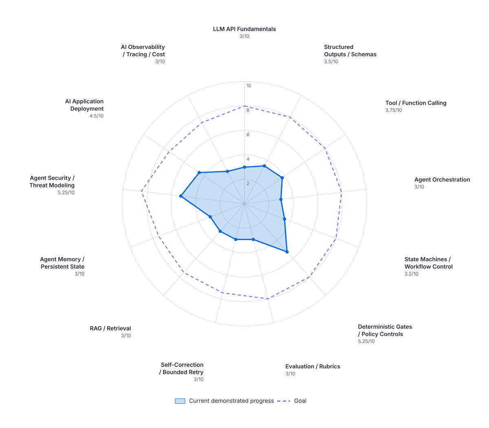

# AI Engineering Hands-On Progress Tracker

**Baseline date:** September 1, 2026  
**Last updated:** September 1, 2026  
**Primary direction:** Applied / Agentic AI Engineering with a security focus  
**Scale:** 0–10, where 10 represents strong specialist-level working knowledge  
**Scoring policy:** Scores change only when a dated lab contains demonstrated implementation evidence. Discussion, recognition, architecture ideas, or correct conceptual answers alone do not increase a score.

---

## Target Outcome

Build reliable AI systems around existing foundation models rather than focus primarily on model training.

```text
External event / alert
        ↓
Deterministic API + schema validation
        ↓
Agent state
        ↓
LLM decision
        ↓
Structured tool request
        ↓
Deterministic authorization / policy gate
        ↓
Tool execution
        ↓
Observation returned to agent
        ↓
Evaluate / retry / escalate / finish
```

The long-term target is a security investigation agent that can collect evidence, select approved tools, reason over results, verify its output against explicit criteria, and request human approval before high-risk actions.

---

## Current Progress Matrix

| Skill area | Initial | Current | Goal | Change | Evidence status |
|---|---:|---:|---:|---:|---|
| LLM API Fundamentals | 2.0 | 2.75 | 8.0 | +0.75 | Direct Responses API use, environment-key handling, system/user roles, FastAPI integration, API-error handling |
| Structured Outputs / Schemas | 2.0 | 3.25 | 8.0 | +1.25 | Pydantic input validation plus direct Pydantic LLM output schema, constraints, descriptions, typed security signals |
| Tool / Function Calling | 2.0 | 2.0 | 8.0 | — | Not implemented |
| Agent Orchestration | 2.5 | 2.5 | 8.0 | — | No multi-step orchestrator yet |
| State Machines / Workflow Control | 2.5 | 2.5 | 8.0 | — | No explicit state machine yet |
| Deterministic Gates / Policy Controls | 3.0 | 3.75 | 8.0 | +0.75 | Input rejection, low-confidence gate, API-failure gate, prompt-injection hard review gate |
| Evaluation / Rubrics | 2.0 | 2.0 | 8.0 | — | Useful failure observations, but no repeatable evaluation harness |
| Self-Correction / Bounded Retry | 2.0 | 2.0 | 7.5 | — | Retry concept discussed but not implemented |
| RAG / Retrieval | 1.5 | 1.5 | 7.5 | — | Not implemented |
| Agent Memory / Persistent State | 1.5 | 1.5 | 7.5 | — | Not implemented |
| Agent Security / Threat Modeling | 3.5 | 4.0 | 8.5 | +0.5 | Executed prompt-injection test, identified unsafe downstream policy, added explicit typed signal + deterministic gate |
| AI Application Deployment | 3.0 | 3.5 | 7.5 | +0.5 | Lab 1 container deployment remains demonstrated; updated LLM-enabled service has not yet been redeployed in Docker |
| AI Observability / Tracing / Cost | 1.5 | 1.5 | 7.5 | — | No token/cost/latency tracing yet |

### Progress Wheel



The solid filled polygon is **current demonstrated progress**. The dashed outline is the target level. Topic labels and current scores are placed around the outer wheel.

---

## Evidence History

### September 1, 2026 — Baseline

The initial scores were deliberately conservative. Existing security, cloud, Kubernetes, API, identity, permissions, and trust-boundary experience provides useful transfer, but conceptual discussion of agents does not count as hands-on AI implementation.

Topics already discussed before hands-on work included agent orchestration, nondeterministic versus deterministic behavior, approval gates, state machines, rubrics, self-correction, bounded retries, tool calling, RAG, memory, and containerized alert ingestion.

**Score changes:** None. This was the baseline.

---

### September 1, 2026 — Lab 1: FastAPI JSON Alert Receiver

**Evidence:** [AI Engineering Lab 1 — FastAPI JSON Alert Receiver](2026-09-01-lab-01-fastapi-json-alert-receiver.md)

Demonstrated hands-on:

- Created and activated a Python virtual environment.
- Installed and ran FastAPI and Uvicorn.
- Created GET and POST API endpoints.
- Used FastAPI-generated `/docs` and OpenAPI behavior.
- Defined a Pydantic `Alert` model.
- Demonstrated required fields, `Literal` restrictions, IP validation, and timestamp validation.
- Distinguished FastAPI, Uvicorn, ASGI, `main.py`, and the in-memory `app` object.
- Built and ran the API in Docker.
- Diagnosed a Windows `Dockerfile.txt` naming failure.
- Verified the service still worked with the host Uvicorn process stopped.

**Score changes:**

| Skill area | Before | After | Reason |
|---|---:|---:|---|
| Structured Outputs / Schemas | 2.0 | 2.25 | Practical schema/type/constraint validation was demonstrated, but not yet on LLM output |
| Deterministic Gates / Policy Controls | 3.0 | 3.25 | Demonstrated deterministic input rejection before downstream application logic |
| AI Application Deployment | 3.0 | 3.5 | Built and ran a reproducible containerized service that will become the agent boundary |

**Why the increases were limited:** The lab was guided and contained no LLM call, model-selected action, orchestration, evaluation harness, or retry controller.

---

### September 1, 2026 — Lab 2: Structured LLM Alert Triage

**Evidence:** [AI Engineering Lab 2 — Structured LLM Alert Triage](2026-09-01-lab-02-structured-llm-alert-triage.md)

Demonstrated hands-on:

- Installed and used the OpenAI Python SDK.
- Made a direct Responses API call and observed free-form output.
- Explained how `OpenAI()` uses `OPENAI_API_KEY` and how a custom environment variable can be passed explicitly.
- Used separate `system` and `user` messages and understood their roles.
- Defined a Pydantic `AlertTriage` model as the LLM structured-output contract.
- Used `Literal`, boolean, bounded confidence values, and field descriptions.
- Connected the validated FastAPI `Alert` object to the LLM call.
- Returned parsed structured model output through `/alert`.
- Tested conflicting incoming severity and explicitly defined input severity as a non-authoritative hint.
- Observed small run-to-run confidence variation.
- Tested vague evidence and observed reduced confidence.
- Added a deterministic `< 0.70` confidence review gate.
- Added `APIError` handling and deliberately tested an invalid API key.
- Diagnosed an HTTP 500 caused by a missing `APIError` import, then verified the controlled `llm_api_failure` path.
- Sent prompt-injection text inside untrusted alert data.
- Identified that the first policy incorrectly treated high confidence as sufficient for `accepted`.
- Added `prompt_injection_detected: bool` as an explicit structured signal.
- Added a deterministic hard review gate for prompt injection.
- Verified the malicious input was routed to `needs_review` regardless of its high confidence.
- Observed semantic overreach when a credential-theft alert was classified more specifically as an LSASS-dump event without supporting evidence.

**Score changes:**

| Skill area | Before | After | Reason |
|---|---:|---:|---|
| LLM API Fundamentals | 2.0 | 2.75 | Direct SDK/API use was integrated into the application and failure behavior was tested |
| Structured Outputs / Schemas | 2.25 | 3.25 | Implemented real LLM structured output with typed constraints, field semantics, and security-relevant signals |
| Deterministic Gates / Policy Controls | 3.25 | 3.75 | Added deterministic low-confidence, API-failure, and prompt-injection workflow controls |
| Agent Security / Threat Modeling | 3.5 | 4.0 | Performed an actual prompt-injection test and corrected a policy weakness exposed by the test |

**Why the increases are limited:** The lab was guided and still used a single model call with no tools, explicit agent state machine, retry controller, formal evaluation suite, RAG, or persistent state. The updated LLM-enabled service was not redeployed into Docker, so AI Application Deployment remains unchanged from Lab 1.

**Important limitation discovered:** Structured output guarantees shape much better than prose, but it does not guarantee semantic correctness. The unsupported `credential_theft_lsass_dump` specificity is direct evidence that later evaluation and evidence-grounding controls are necessary.

---

# Hands-On Lab Roadmap

| Lab | Topic | Core outcome | Status |
|---:|---|---|---|
| 1 | JSON Alert Receiver | FastAPI + Pydantic + Docker deterministic boundary | **Completed** |
| 2 | Structured LLM Alert Triage | Direct LLM API call with validated structured result and deterministic review gates | **Completed** |
| 3 | Read-Only Investigation Tools | Model selects tools; Python executes validated calls | **Next** |
| 4 | Policy-Gated Tools | Separate model intent from deterministic authorization | Planned |
| 5 | Investigation State Machine | Explicit states, transitions, limits, and terminal outcomes | Planned |
| 6 | Rubrics and Evaluation | Repeatable test cases and failure categories | Planned |
| 7 | Bounded Self-Correction | Evaluate → feedback → limited retry → escalate | Planned |
| 8 | RAG | Retrieve security knowledge with source attribution | Planned |
| 9 | Persistent State / Memory | Resume investigations from external state | Planned |
| 10 | Agent Security | Prompt injection, malicious tool output, exfiltration, permission attacks | Planned |
| 11 | Observability | Trace model calls, tools, states, policy decisions, latency, tokens, and cost | Planned |
| 12 | Cloud / Kubernetes Deployment | Apply workload identity, least privilege, secrets, network and pod controls | Planned |

---

## Lab 3 Target Architecture

```text
validated alert
      ↓
LLM decides what evidence is needed
      ↓
structured tool request
      ↓
Python validates tool + arguments
      ↓
read-only tool executes
      ↓
tool result returned to LLM
      ↓
structured conclusion
```

Initial tools should be mocked or local so the control loop is visible before cloud/security APIs are introduced, for example:

```text
get_ip_reputation(ip)
get_recent_auth_events(user)
get_asset_info(host)
```

Lab 3 should demonstrate model-selected tool choice, validated arguments, Python-controlled execution, tool-result return to the model, and the ability to conclude that evidence is insufficient.

---

## Learning Order

```text
1. API + JSON validation              DONE
2. LLM API                            DONE
3. structured LLM outputs             DONE
4. tool calling                       NEXT
5. deterministic tool-policy gates
6. state machine
7. evaluation/rubric
8. bounded self-correction
9. RAG
10. memory/state persistence
11. deeper agent security
12. observability
13. AWS/Kubernetes deployment
```

Do not rely heavily on agent frameworks at the beginning. Implement the first versions directly enough to understand model calls, schema validation, state, tool execution, retry behavior, and security boundaries before adding orchestration frameworks.

---

## Evidence Rules for Future Updates

After each lab, create a dated Markdown note under `ai-engineering/` containing:

1. Goal and architecture.
2. Commands/code used.
3. What succeeded.
4. What failed.
5. Troubleshooting performed.
6. Questions and answers.
7. Security implications.
8. What was independently understood versus completed with guidance.
9. Score changes, only when justified.

A correct conceptual answer alone does not raise a score.